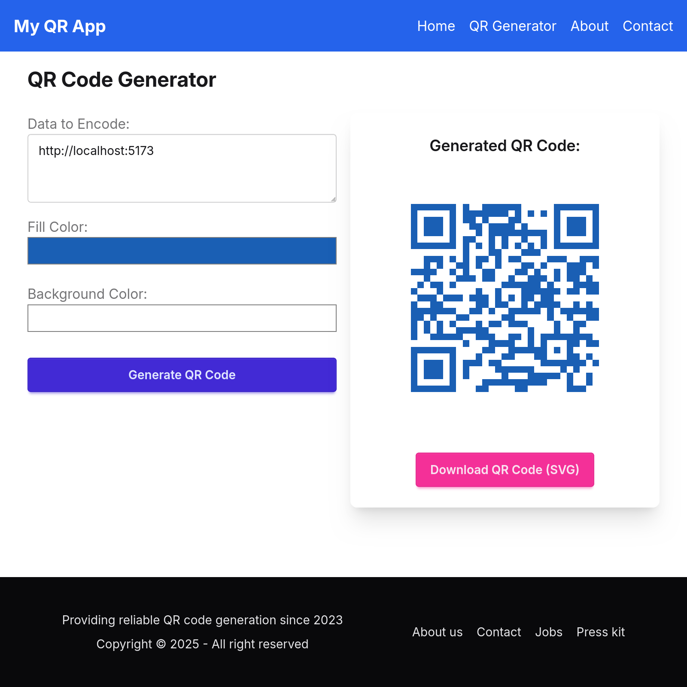

## Screenshot



### DIY

If you're familiar with deploying Node applications, the built-in Remix app server is production-ready.

Make sure to deploy the output of `npm run build`

- `build/server`
- `build/client`

## Styling

This template comes with [Tailwind CSS](https://tailwindcss.com/) already configured for a simple default starting experience. You can use whatever css framework you prefer. See the [Vite docs on css](https://vitejs.dev/guide/features.html#css) for more information.
# QR Code Generator Web UI 🚀

A simple and intuitive web application built with **Remix.js** to generate QR codes with customizable foreground and background colors. Easily create QR codes for URLs, text, or any other data you need!

---

## Features ✨

* **Generate QR Codes:** Instantly create QR codes for any text or URL.
* **Custom Colors:**
    * Choose a **custom foreground color** for the QR code.
    * Choose a **custom background color** for the QR code.
* **Live Preview:** See your QR code update in real-time as you type and select colors.
* **Download QR Code:** Easily download the generated QR code as an image file (e.g., PNG).
* **Responsive Design:** Works seamlessly on desktop and mobile devices.

---

## Tech Stack 💻

* **Framework:** [Remix.js](https://remix.run/)
* **Frontend:** React, HTML, CSS (potentially Tailwind CSS or other styling solutions if used)
* **QR Code Generation Library:** (Specify the library used, e.g., `qrcode.react` or similar)

---

## Getting Started 🛠️

Follow these instructions to get a local copy up and running.

### Prerequisites

* Node.js (node v22.14.0 (npm v10.9.2) or higher)
* npm or yarn

### Installation

1.  **Clone the repository:**
    ```bash
    git clone https://github.com/japrogramer/remix-qr.git
    cd remix-qr
    ```

2.  **Install dependencies:**
    Using npm:
    ```bash
    npm install
    ```
    Or using yarn:
    ```bash
    yarn install
    ```

### Running the Development Server

1.  **Start the Remix development server:**
    Using npm:
    ```bash
    $npm run dev
    > dev
    > remix vite:dev

      ➜  Local:   http://localhost:5173/
      ➜  Network: use --host to expose
      ➜  press h + enter to show help

    ```

2.  Open your browser and navigate to `http://localhost:5173` (or the port specified in your console).

---

## Usage 🎨

1.  **Enter Data:** Type or paste the text/URL you want to encode into the input field.
2.  **Choose Foreground Color:** Use the color picker to select the desired color for the QR code pattern.
3.  **Choose Background Color:** Use the color picker to select the desired color for the QR code background.
4.  **Preview:** The QR code will update automatically.
5.  **Download:** Click the "Download QR Code" button to save the image to your device.

---

## Contributing 🤝

Contributions are welcome! If you have suggestions for improvements or want to fix a bug, please feel free to:

1.  Fork the Project
2.  Create your Feature Branch
3.  Commit your Changes
4.  Push to the Branch
5.  Open a Pull Request

---

## License 📄

This project is licensed under the MIT License - see the `LICENSE.md` file for details (if you have one).

---
Happy QR Coding! 🎉
